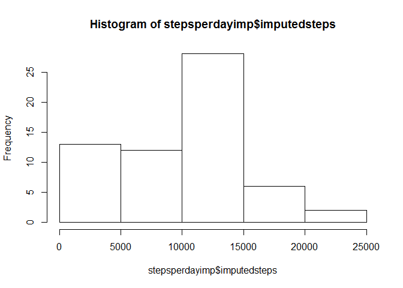
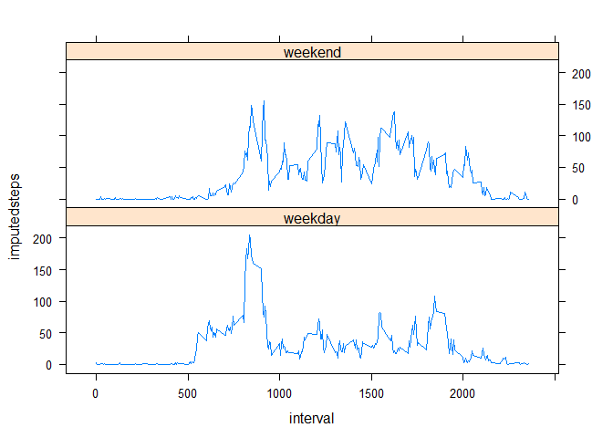

# Reproducible Research: Peer Assessment 1 9/13/2015


## Loading and preprocessing the data

```r
unzip("activity.zip")
activitydata3 <- read.csv("activity.csv")
```


## What is mean total number of steps taken per day?
This is what the distribution of steps per day looks like...

```r
stepsperday <- aggregate(steps ~ date, data = activitydata3, na.rm = TRUE, FUN = sum)
hist(stepsperday$steps)
```

 

This is the mean number of steps per day:

```r
meanstepsperday <- mean(stepsperday$steps)
meanstepsperday
```

```
## [1] 10766.19
```

This is the median number of steps per day:

```r
medianstepsperday <- median(stepsperday$steps)
medianstepsperday
```

```
## [1] 10765
```


## What is the average daily activity pattern?
This is what the average day looks like in terms of steps per interval.

```r
stepsperinterval <- aggregate(steps ~ interval, data = activitydata3, na.rm = TRUE, FUN = mean)
plot(stepsperinterval, type = "l")
```

 


This is the interval that has the highest average steps:

```r
maxtime <- which.max(stepsperinterval$steps)
stepsperinterval[maxtime, 1]
```

```
## [1] 835
```


## Imputing missing values
This is the number of intervals with missing data for steps:

```r
sum(is.na(activitydata3$steps))
```

```
## [1] 2304
```
We are going to replace the missing step data with the median for that interval and create a new dataset with those imputed steps.

```r
medianperinterval <- aggregate(steps ~ interval, data = activitydata3, na.rm = TRUE, FUN = median)
impd3 <- merge(activitydata3, medianperinterval, by.x = "interval", by.y = "interval")
impd3$imputedsteps <- impd3$steps.x
impd3$imputedsteps <- ifelse(is.na(impd3$imputedsteps), impd3$steps.y, impd3$steps.x)
activitydataimp <- subset(impd3, select = c("interval", "imputedsteps", "date"))
```

This is a histogram of the total steps per day with the imputed dataset:

```r
stepsperdayimp <- aggregate(imputedsteps ~ date, data = activitydataimp, na.rm = TRUE, FUN = sum)
hist(stepsperdayimp$imputedsteps)
```

 

This is the mean number of steps per day in the imputed data:

```r
impmeanday <- mean(stepsperdayimp$imputedsteps)
impmeanday
```

```
## [1] 9503.869
```

This is the median number of steps per day in the imputed data:

```r
impmedianday <- median(stepsperdayimp$imputedsteps)
impmedianday
```

```
## [1] 10395
```

This is the difference between the mean steps per day with the original and the imputed data:

```r
impmeanday - meanstepsperday
```

```
## [1] -1262.32
```

This is the difference between the median steps per day with the original and imputed data:

```r
impmedianday - medianstepsperday
```

```
## [1] -370
```

It appears that the imputation decreases the mean and median.


## Are there differences in activity patterns between weekdays and weekends?
Here are two plots comparing average steps across intervals in a day.
You might notice that during the week that steps start a bit earlier (going to work) but during the weekend steps are a bit higher through the middle of the day (don't have to sit at desk).

```r
activitydataimp$date <- as.Date(activitydataimp$date, "%Y-%m-%d")
activitydataimp$weekday <- weekdays(activitydataimp$date)
activitydataimp$weekpart <- ifelse((activitydataimp$weekday == "Saturday" | activitydataimp$weekday == "Sunday"), "weekend", "weekday")
compareweekstepsperinterval <- aggregate(imputedsteps ~ interval + weekpart, data = activitydataimp, FUN = mean)
library(lattice)
xyplot(imputedsteps ~ interval | weekpart, compareweekstepsperinterval, type = "l", layout = c(1,2))
```

 
